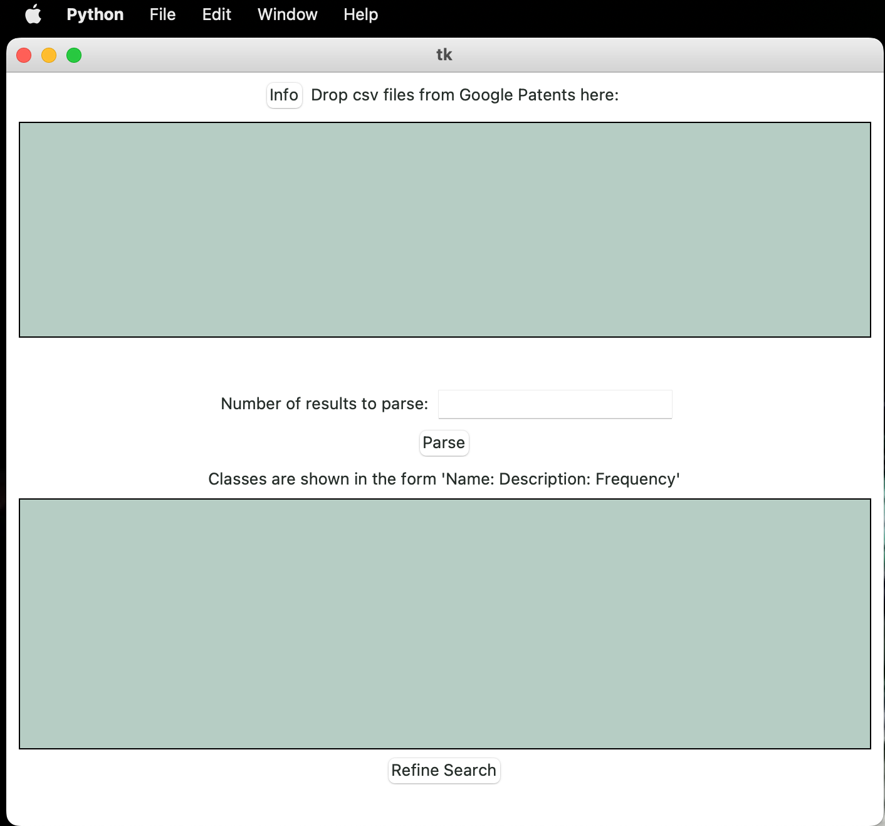
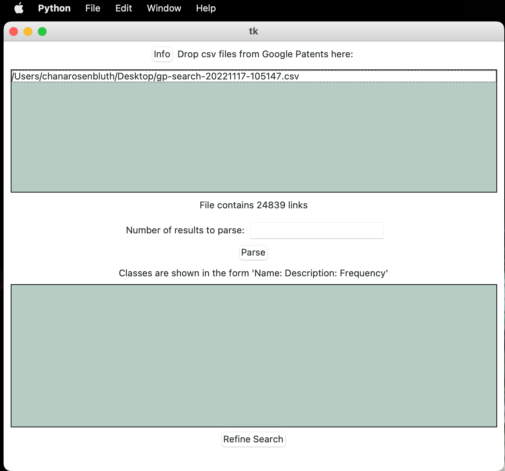

# Play That Song

This is an app to allow a user to parse a csv of patents from Google Patents. The parser returns a lost of classes from 
the patents, showing their name, description, and frequency. Users can refine their search by adding and removing 
classes.

This project uses the following:
- [BeautifulSoup](https://www.crummy.com/software/BeautifulSoup/bs4/doc/)
- [TkinterDND](https://pypi.org/project/tkinterDnD/)

